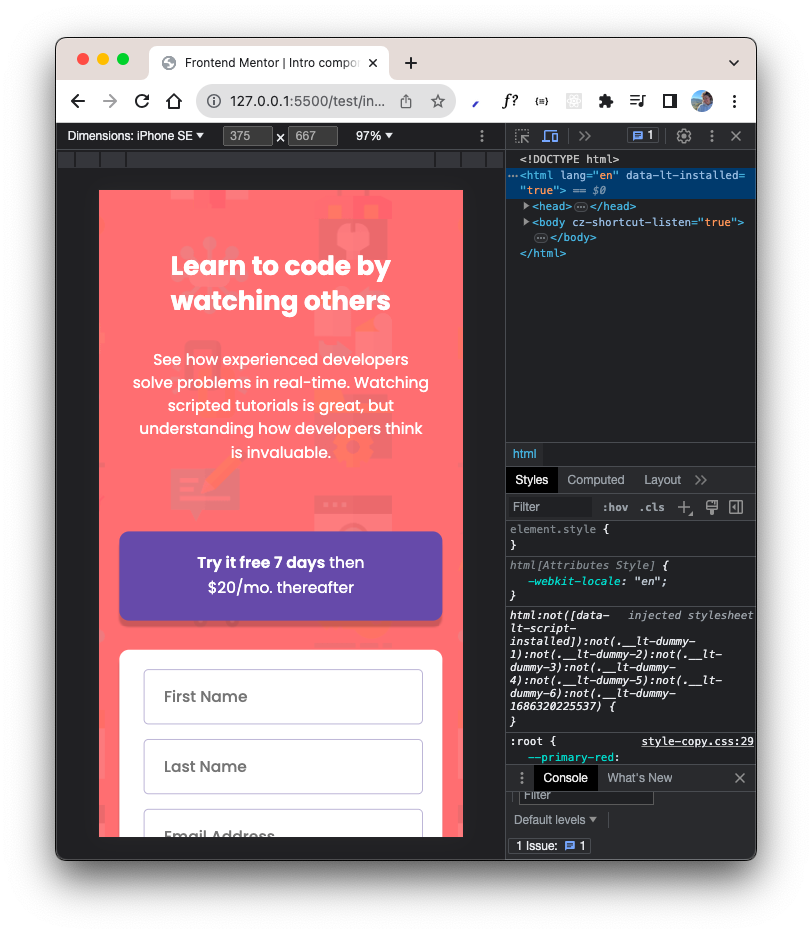

# Frontend Mentor - Intro component with sign up form solution

This is a solution to the [Intro component with sign up form challenge on Frontend Mentor](https://www.frontendmentor.io/challenges/intro-component-with-signup-form-5cf91bd49edda32581d28fd1). 

## Table of contents

- [Overview](#overview)
  - [The challenge](#the-challenge)
  - [Screenshot](#screenshot)
  - [Links](#links)
- [My process](#my-process)
  - [Built with](#built-with)
  - [What I learned](#what-i-learned)
  - [Useful resources](#useful-resources)
- [Author](#author)

**Note: Delete this note and update the table of contents based on what sections you keep.**

## Overview

### The challenge

Users should be able to:

- View the optimal layout for the site depending on their device's screen size
- See hover states for all interactive elements on the page
- Receive an error message when the `form` is submitted if:
  - Any `input` field is empty. The message for this error should say _"[Field Name] cannot be empty"_
  - The email address is not formatted correctly (i.e. a correct email address should have this structure: `name@host.tld`). The message for this error should say _"Looks like this is not an email"_

### Screenshot





### Links

- Live site - https://sue-intro-component-with-signup-form.netlify.app/

## My process

### Built with

- Semantic HTML5 markup
- CSS custom properties
- Flexbox

### What I learned

Validation form. Create properties like minlength and pattern. How to automatize every input validation.

To see how you can add code snippets, see below:

```html
<input minlength="2" />
```

```html
<input pattern="^(.+)@(.+).(.+)" />
```

```js
    {
      attribute: "minlength",
      isValid: (input) =>
        input.value && input.value.length >= parseInt(input.minLength),
      errorMessage: (input, label) =>
        `${label.textContent} needs to be at least ${input.minLength} characters`,
    },
```

```js
const validateAllFormGroups = (formToValidate) => {
  //   create array from all inputs
  const formGroups = Array.from(formToValidate.querySelectorAll(".formGroup"));
};
```

```js
     {
      attribute: "required",
      isValid: (input) => input.value.trim() !== "",
      errorMessage: (input, label) => `${label.textContent} cannot be empty`,
    },
```

### Useful resources

- [The best method to validate form and add validation icons](https://www.youtube.com/watch?v=iyngFd6f8ko)
- [Another one method to validate form](https://codepen.io/javascriptacademy-stash/pen/oNeNMNR)
- [CSS box shadow generator](https://generators.shecodes.io/css-box-shadow-generator)

## Author

- Frontend Mentor - [@shoproizoshlo](https://www.frontendmentor.io/profile/shoproizoshlo)
